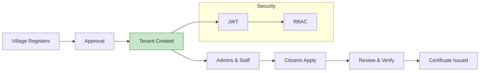

<!-- Hero -->

  
  
  <h1>👋 Hi, I'm <b>ASJAD JOHAR DAWRE</b></h1>
  <h3>🚀 Full Stack Engineer (MERN / PERN) • Backend-Focused • System Design Enthusiast</h3>

  
  
  

---
 <!--

  

-->
## ⚡ About Me
- Backend-leaning full stack developer building production-grade APIs and multi-tenant systems
- Delivered 57% latency reduction across MERN/PERN apps using indexing, caching (Redis), and API tuning
- Comfortable with REST design, RBAC, JWT/OAuth, Razorpay, and scalable database schemas
- Currently focusing on: performance engineering, API observability, and clean architecture

---

## 🧠 Tech Stack

  
| Category | Tools |
|---|---|
| Languages |     |
| Backend |    |
| Frontend |    |
| Databases |    |
| Auth/Payments |    |
| DevOps/Tools |      |

---

## 🏆 Impact At A Glance
- 10,000+ users served across platforms
- 40–70% API performance boost via caching, indexes, and query plans
- 57% average latency reduction across services
- Built role-based multi-tenant systems with secure auth and strong isolation

---

## 🚀 Flagship Projects

### 1) E‑Gram Panchayat — Multi‑Tenant Digital Governance Platform
Tech: React, Node.js, Express, MongoDB, JWT, RBAC, Tailwind CSS

- Automated Birth/NOC/Household service flows for 10k+ villagers
- 70% faster processing via indexed queries and robust error middleware
- JWT auth with custom RBAC workflows → 60% faster onboarding
- 40% API latency reduction; uptime improved to 95.9%
- Live: `https://e-grampanchayat.onrender.com/` • Repo: [`E-Gram-Panchayat`](https://github.com/AsjadJDawre/E-Gram-Panchayat)

---

### 2) Refill Buddy — Gas Refill Booking Platform
Tech: React, Node.js, Express, MongoDB, Razorpay, Tailwind

- REST APIs + Razorpay (prepaid/COD) with JWT-based RBAC middleware
- Automated quotas; 50% manual effort reduced, higher compliance
- Load-tested 1000+ scenarios; indexes + caching → 420ms → 180ms
- Handles 50+ concurrent sessions reliably
- Repo: [`Refill-Buddy`](https://github.com/AsjadJDawre/Refill-Buddy)

---

### 3) AcademiaSuite — Academic Management (Desktop)
Tech: React, Electron, Tailwind, Local/Cloud storage

- Desktop suite for academic ops with real-time validation and modular UIs
- Repo: [`AcademiaSuite`](https://github.com/AsjadJDawre/AcademiaSuite)

### 4) NSS Project — Service & Volunteer Management
- Digitized event scheduling, volunteer tracking, and reporting
- Focused on simple UX + transparent record-keeping

---

## 🧩 What I Do Best
- Design clean, scalable REST APIs with versioning, pagination, and middleware
- Craft efficient data models (PostgreSQL joins/indexes, Mongo aggregates)
- Build secure auth flows (JWT/OAuth, role-based permissions)
- Squeeze performance: query tuning, Redis caching, N+1 elimination
- Ship resilient systems: logging, error handling, retry/backoff, CI/CD

---

## 🧪 Recent Internship (Unified Mentor) — Sep 2024 – Dec 2024
- Shipped 3 secure MERN apps with JWT/OAuth and Razorpay
- Implemented RBAC across modules; optimized queries + caching for 40–70% perf gains
- Worked Agile, did peer reviews, and productionized APIs with CI/CD

---

## 📊 GitHub Snapshot

  
  

---

## 🎓 Certifications
- The Complete 2024 Web Development Bootcamp — Udemy
- Cloud Computing — IBM
- C Programming — Udemy

---

## 🤝 Let’s Build Something Meaningful
I’m open to backend-heavy roles, platform engineering, and product-focused teams that value performance, clarity, and shipping.  
If you have an ambitious idea with real-world impact — let’s talk.

  
  
  

